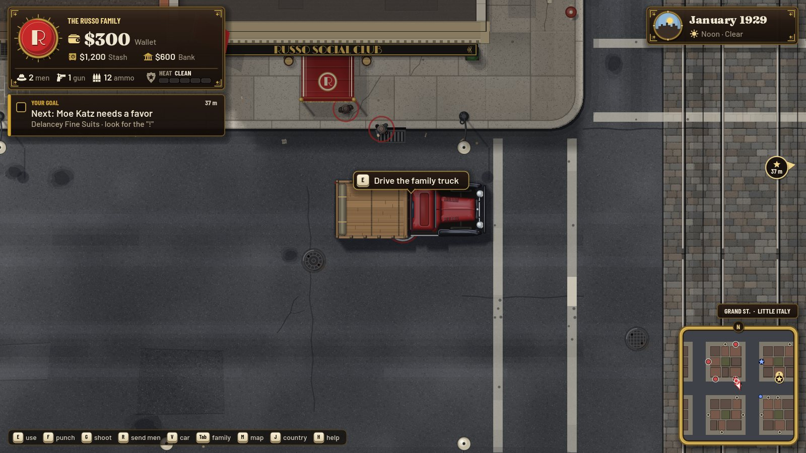
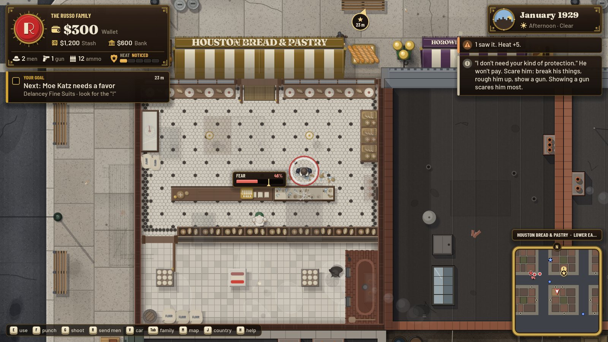
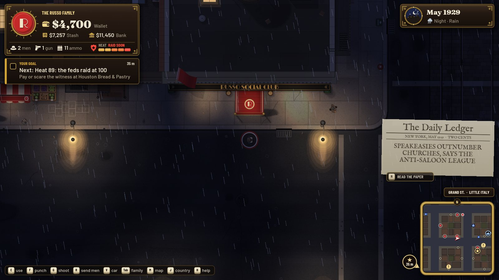
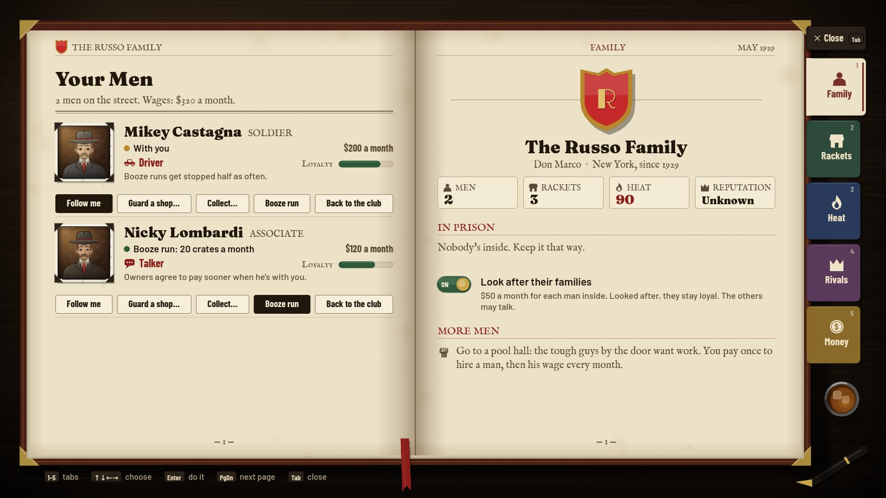
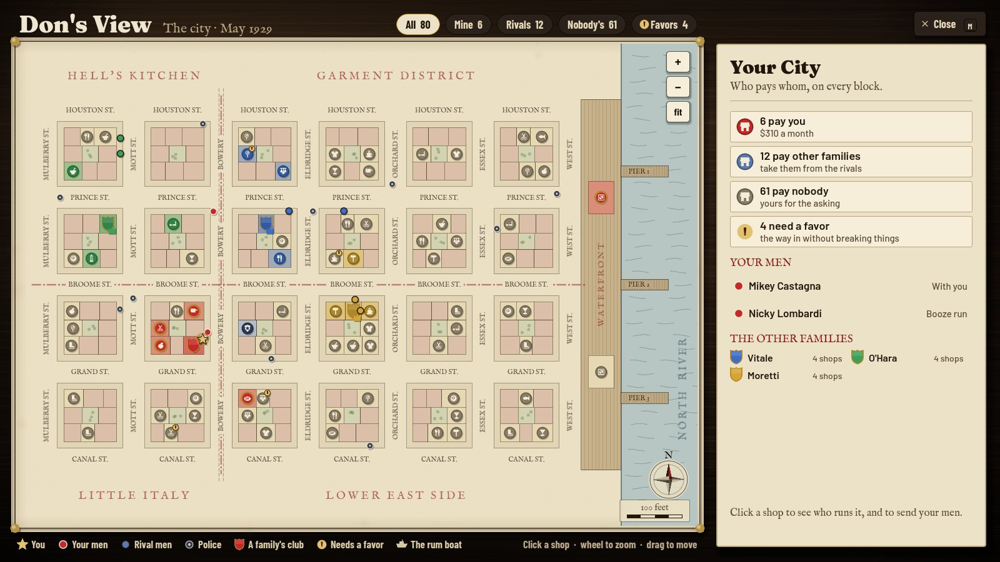

# Famiglia

A 1920s Mafia game for **1 to 8 players**, made in **Godot 4.7**. You walk the streets of Lower
Manhattan, seen from straight above, as the boss of a crime family: walk into a shop and lean on
the owner until he pays, hire muscle at the pool hall, buy a cop, open a speakeasy in the back of a
bakery, run whisky off the night boat, and take the city one door at a time. Past New York
there's the whole country: cities to take, smuggling routes to buy, convoys to run and hijack.

Solo play puts you against AI families. With friends, each player founds a family (or joins a
friend's as underboss), and AI families fill the rest of the city. Players who join a running
campaign take over an AI family. Rejoining with the same name gives you your seat back.

| | |
|---|---|
|  |  |
|  |  |

## Run it

1. Install **Godot 4.7** (standard, not .NET).
2. Import `game/project.godot` and let it import once, then press **F5**.
3. **New game** (with Uncle Carmine's tutorial, or without), **Play with friends** (host, or join
   with the host's IP; the port is 24880, forward it for internet play), or **Continue**.

A campaign runs *1929 to 1933* (the Crash and Repeal) or *1923 to 1933* (all of Prohibition); a
month is a day and a night on the street. The host autosaves every three months and on quit.
Playing alone, the city waits while a menu, a map or a conversation is open.

## Controls

| Key | |
|---|---|
| WASD / arrows | walk (Shift run, Alt stroll) |
| E | talk / use: people, the safe, the desk, the map table, the telephone, a till, crates, the truck |
| F or left click | punch, or smash what's in front of you |
| G or right click | shoot (needs a gun and bullets, and it's loud) · the mouse aims |
| R | send your men at the person you face |
| V | get in / out of a car (W/S drive, A/D steer, Space brake) · next to traffic: steal it |
| Q | drop the crate you carry |
| Tab | the family book: your men, your rackets, the heat on you, rivals, money |
| M | Don's View: the whole city, who pays whom, send your men |
| J | the country: cities, routes, capos |
| N | the newspaper · **H** how to play · **Esc** pause · wheel or +/- zoom |

## How it plays

**The street.** A generated Lower Manhattan in five districts (Hell's Kitchen, the Garment
District, Little Italy, the Lower East Side, the Waterfront): cobbled and paved streets, streetcar
tracks down the Bowery, pushcarts on Orchard St., backyards with laundry, the quay and the piers.
About 60 businesses you walk into: the roof fades and you're in the bakery with the baker behind
his counter. Day and night pass once a month, with rain and fog; at night the lamps light the
sidewalks and your speakeasies fill up.

**Shakedowns.** Offer protection face to face. If he says no, scare him: break his things, rough
him up, show a gun, bring your men. Every owner has a **weak spot** that scares him twice as much
(the street tells you what it is). When his fear reaches the mark he pays; push him past it and he
runs to the cops. Or do him a **favor** (a shop with a "!" over its door needs one) and he pays you
out of gratitude.

**Money.** Your **Wallet** is cash on you (lost if you're knocked down). The **Stash** is the family's
dirty money, in the safe at your club: it pays wages and bribes. The **Bank** is clean money: it buys
businesses. A shop you own is a **front**: it turns Stash into Bank every month. A front can hide a
**speakeasy** in the back.

**Booze.** At night a boat ties up at the middle pier. Buy crates, carry them to your truck, drive
to your speakeasy. Or buy a warehouse on the quay and let convoys from the country fill it.

**Men.** Hire muscle at the pool halls. Each man has a **specialty** (bruiser, shooter, driver,
talker, medic, earner). They follow you, guard your shops, collect your envelopes, run booze, and
take shops for you. Pay them, and look after the families of the ones in prison, or they talk.

**Crime rings.** Protect or own every shop of a trade in the city to get its perk: the pawnshops
(half-price guns), the laundries (cheap laundering), the restaurants (cheaper wages), the cigar and
candy stores (the numbers game), and more.

**The law.** What people see becomes **heat**, and heat is a real file: named witnesses (pay or scare
them in their shop), a patrolman's notebook (buy the cop), your gun (throw it in the river), the
books (burn them at your club), bodies, informants. Cops chase what they see: bribe them, go quietly
or run. At 100 heat the feds raid you, and you'll see them pull up outside.

**Rivals.** AI families expand, post guards at their shops, lean on yours, hold grudges and offer or
demand deals. Sit down with any boss: truces, paying for peace, tribute, alliances. Nothing is
enforced. Kill a weakened don in his club and his family is finished; finish them all and you run New York.

**The country (J).** A 1920s atlas plate: nine cities with their own outfits, smuggling routes from
Montreal, Windsor, Rum Row and Havana, rail freight between your warehouses, breweries, dock unions
and yardmasters. Send men and capos, buy the police, order hits, run convoys, hijack rivals.

**The end.** Repeal (December 1933) ranks the families by legacy: clean money, what they own, who
pays them, their name on the street, minus the case against them.

## Multiplayer

Host-authoritative ENet (`scripts/net/net.gd`). The host runs the rules and the AI and sends the
campaign state when it changes, plus position snapshots at 10 Hz; each client moves its own boss
and car and asks the host to act. Solo uses the same code path with an offline peer.

## Code map

| File | |
|---|---|
| `scripts/core/game.gd` | autoload `Game`: the campaign, economy, law, evidence, guns, deals, AI families, save/load |
| `scripts/core/rackets.gd`, `favors.gd` | shakedowns and weak spots, crime rings, crew specialties, robberies, finishing a family; favors |
| `scripts/core/syndicate.gd`, `map_projection.gd` | the country: cities, routes, convoys, freight, capos, hits; the map projection |
| `scripts/net/net.gd` | autoload `Net`: solo / host / join, lobby, requests, state and snapshots |
| `scripts/world/world.gd` | the street: building the city, collisions and paths, spawning, the host simulation, requests |
| `scripts/world/actor.gd`, `vehicle.gd`, `player_controller.gd`, `camera_rig.gd` | people and their brains, cars, your hands, the camera |
| `scripts/world/talk.gd` | what you can say to whom: every conversation and its options |
| `scripts/world/city_plan.gd` | the city as data, from a seed (metres) |
| `scripts/world2d/*` | the 2D art: `w.gd` (units, fonts), `pal.gd` (colours), `draw.gd`, people, cars, streets, roofs, shopfronts, interiors, lighting, weather |
| `scripts/ui/*` | HUD (`hud.gd`, `hud/*`), portraits, the family book and Don's View (`family_book.gd`, `city_map.gd`, `book/*`), the country map, the tutorial and advisor, the main menu (`main_menu.gd`, `menu/*`), the 1920s UI kit (`ui_kit.gd`) |
| `scripts/core/settings.gd` | volumes, full screen, UI scale, the keys strip (saved in `user://settings.cfg`) |
| `docs/REBUILD_2D.md` | the architecture and the contract between the pieces |

## Tests

`game/tools/dev/test_all.sh` compiles every script and plays four headless tests: the autotest
(walk, a shakedown, the warehouse, the union, months passing), the tutorial start to finish, one
favor of each kind, and the solo pause. Run it before you push.

With a screen: `godot --path game res://scenes/main.tscn -- --autotest --shot=/tmp/f` saves
screenshots of each step. `-- --autotest --sim=36` lets 36 months pass and prints the families'
money (balance). Multiplayer: `tools/dev/mptest.sh`.

`python3 game/tools/map/build_map.py` rebuilds the country plate (`assets/map/country_map.jpg`) from
public-domain map data (needs numpy and Pillow).

## Assets and licences

- Everything on the street is drawn in code (people, cars, streets, buildings, interiors).
- The country map: Natural Earth (public domain), USGS GMTED2010 / NOAA ETOPO1 relief (public
  domain), lettered in IM Fell (SIL OFL) and Limelight (SIL OFL).
- Rain, murmur, music, UI and fight sounds: the owner's own Woods / Keep Rolling audio. The
  gunshot, glass, engine and whistle were synthesised for this game.
- Fonts: Fraunces, Barlow, IM Fell, Limelight, Playfair, Special Elite, Courier Prime, Rye (SIL OFL / Apache, licences in `assets/fonts/` and `assets/map/`).
- The UI kit art in `assets/ui` is generated by `tools/ui/make_ui_art.py`.
